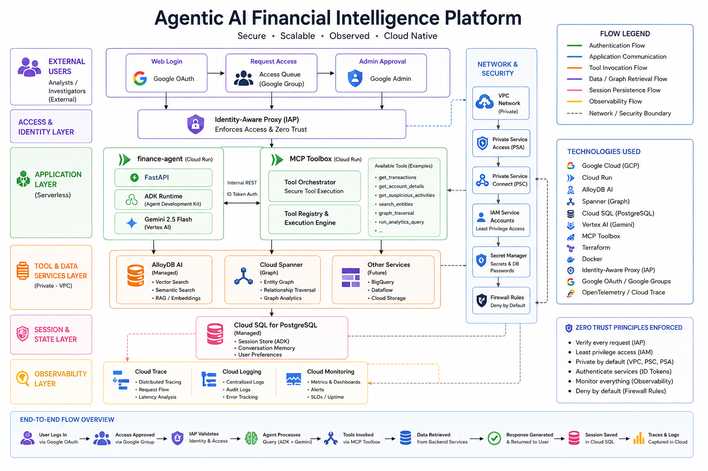

# Agentic AI Financial Intelligence Platform

A cloud-native, zero-trust Agentic AI platform designed for financial investigation, fraud analysis, graph-based reasoning, and secure enterprise-style AI orchestration on Google Cloud.

The platform combines Retrieval-Augmented Generation (RAG), graph-enhanced intelligence, secure tool orchestration, and conversational AI workflows using Google ADK, Gemini, AlloyDB AI, Spanner Graph, Cloud Run, and Identity-Aware Proxy (IAP).

---

# Architecture Overview



### Core Architecture Layers

## Frontend Runtime Layer

* FastAPI + Google ADK runtime deployed on Cloud Run
* Gemini-powered conversational AI workflows
* Secure external access using IAP and OAuth

## Tool Orchestration Layer

* MCP Toolbox for governed tool execution
* Controlled AI access to backend systems
* Service-to-service authentication using ID tokens

## Data Intelligence Layer

* AlloyDB AI for semantic retrieval and vector search
* Cloud Spanner Graph for graph traversal and entity intelligence
* Cloud SQL for session persistence and conversational memory

## Infrastructure & Security Layer

* Infrastructure-as-Code provisioning using Terraform
* Dockerized Cloud Run deployments
* Private VPC networking using PSA + PSC
* IAM-based least-privilege access control
* Google Groups-based approval workflow

## Observability Layer

* OpenTelemetry instrumentation
* Cloud Trace
* Cloud Logging
* Cloud Monitoring

---

# Key Features

* Agentic AI orchestration using Google ADK
* Secure MCP-based tool execution
* GraphRAG-style retrieval workflows
* Conversational financial investigation workflows
* Zero-trust cloud architecture
* Cloud-native serverless deployment
* Infrastructure-as-Code provisioning with Terraform
* Distributed tracing and observability
* Stateful conversational memory

---

# Tech Stack

| Layer          | Technologies                               |
| -------------- | ------------------------------------------ |
| AI Runtime     | Gemini 2.5 Flash, Vertex AI, Google ADK    |
| Orchestration  | MCP Toolbox                                |
| Databases      | AlloyDB AI, Cloud Spanner Graph, Cloud SQL |
| Infrastructure | Cloud Run, Docker, Terraform               |
| Security       | IAP, OAuth, IAM, Google Groups             |
| Observability  | OpenTelemetry, Cloud Trace, Cloud Logging  |

---

# Repository Structure

```text
architecture/
    architecture-diagram.png
    interactive-architecture.html

notebooks/
    00_Environment_and_Infrastructure_Setup.ipynb
    01_Database_Setup_and_Exploration.ipynb
    02_MCP_Toolbox_Deployment.ipynb
    03_ADK_Agent_Runtime.ipynb
    04_AlloyDB_Natural_Language_Configuration.ipynb
    05_Interactive_Finance_Agent_Deployment.ipynb

terraform/
    main.tf
    variables.tf
    outputs.tf

screenshots/
    architecture-preview.png
    ui-preview.png
```

The Terraform configuration provisions the foundational infrastructure required for the platform, including networking, IAM configuration, managed database resources, and Cloud Run deployment dependencies. Deployment-specific secrets and sensitive configurations have been sanitized for public release.

---

# Getting Started

## Prerequisites

* Google Cloud Project
* Vertex AI enabled
* AlloyDB AI enabled
* Cloud Spanner enabled
* Docker installed
* Terraform installed
* Appropriate IAM permissions

## Deployment Flow

Run notebooks sequentially:

1. Environment and infrastructure setup
2. Database setup and exploration
3. MCP Toolbox deployment
4. ADK agent runtime setup
5. AlloyDB AI natural-language configuration
6. Interactive finance agent deployment

---

# Security Model

The platform follows a zero-trust architecture model:

* Backend services are isolated inside a private VPC
* Databases are not publicly exposed
* Frontend access is protected using IAP + OAuth
* External access governance is managed using Google Groups
* Internal service communication uses ID-token-based authentication

---

# Future Improvements

* Redis-based semantic caching layer
* Custom production frontend replacing ADK developer UI
* Multi-agent orchestration workflows
* Automated evaluation pipelines
* Streaming GraphRAG optimization
* Response re-ranking pipelines

---

# Production Readiness Notice

This repository represents a portfolio and educational implementation of a cloud-native Agentic AI platform and should not be considered production-ready for unrestricted public deployment in its current form.

While the project incorporates several enterprise-oriented architectural patterns such as:

* zero-trust access control
* private networking
* IAM-based authentication
* IAP-secured access
* governed tool orchestration
* observability instrumentation

a production-grade deployment would still require additional hardening and operational safeguards, including:

* advanced rate limiting and abuse protection
* Web Application Firewall (WAF) integration
* enhanced RBAC and tenant isolation
* automated security auditing
* secrets rotation policies
* production-grade CI/CD pipelines
* disaster recovery and backup strategies
* advanced monitoring and alerting
* multi-region resiliency and failover
* formal security reviews and penetration testing

This implementation is intended to demonstrate architectural design, cloud infrastructure orchestration, secure AI system patterns, and enterprise-style deployment workflows rather than serve as a fully production-certified financial platform.


# Disclaimer

This repository is a sanitized educational and portfolio version of the original implementation. Sensitive infrastructure identifiers, secrets, and deployment-specific configurations have been removed or generalized for security purposes.
